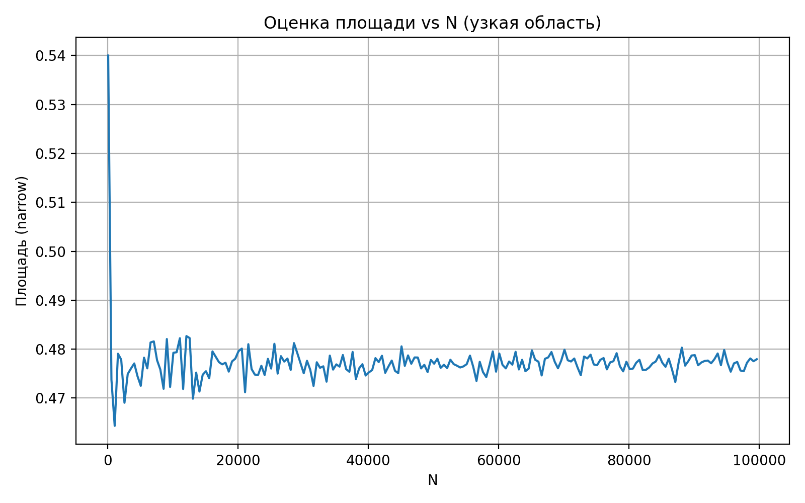
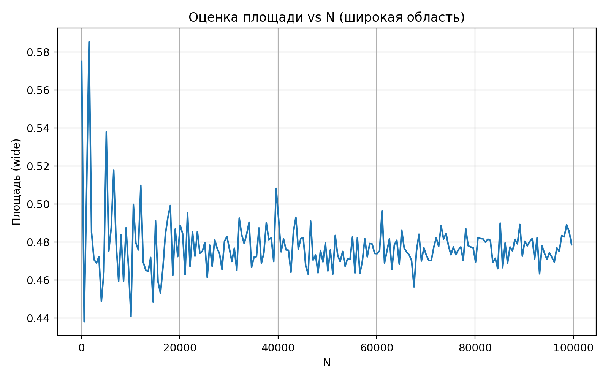
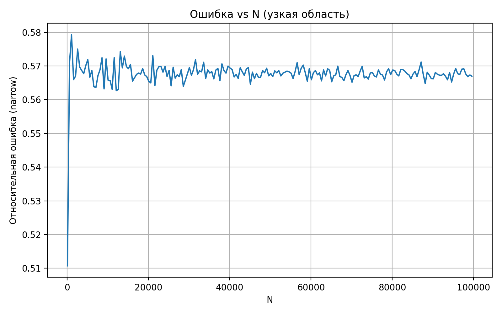

Садиков Амир БПИ244 

# Задача
Необходимо вычислить площадь фигуры, образованной пересечением трёх окружностей
и исследовать, как точность метода Монте-Карло зависит от:
размера прямоугольника, в котором генерируются точки (широкий / узкий),
количества сгенерированных точек $N$

Также требуется сравнить результаты с точным значением площади, полученным в PDF путём разбиения фигуры на треугольник и три круговых сегмента

# Решение

# Решение для CodeForce

Храним координаты центра, радиус и квадрат радиуса `r2` для ускорения вычисления.

Для проверки попадания точки внутрь окружности используется функция
```c++
inline bool inside(const Circle &c, double px, double py) {
    double dx = px - c.x;
    double dy = py - c.y;
    return dx*dx + dy*dy <= c.r2;
}
```

Ключевой момент
Попадание в пересечение трёх окружностей означает:
$(x, y) \in C_1 \cap C_2 \cap C_3$

Дальше нам надо построить узкий прямоугольник, он строится как пересечения проекций окружности на оси X и Y

```c++
double lx = max(c1.x - c1.r, c2.x - c2.r, c3.x - c3.r);
double rx = min(c1.x + c1.r, c2.x + c2.r, c3.x + c3.r);
double ly = max(c1.y - c1.r, c2.y - c2.r, c3.y - c3.r);
double ry = min(c1.y + c1.r, c2.y + c2.r, c3.y + c3.r);
```

Такой минимальный прямоугольник содержит все точки которые могут одновременно быть внутри всех трех кругов и полностью исключает внешности области. Это нам дает уменьшение количество пустых точек и существенно снижает дисперсию оценки Монте-Карло

Используем фиксированные сеед т.к это требуется в codeforce. Решение всегда будет давать одинаковый ответ при требуемым вводом

Алгоритм Монте-Карло
Мы создаем 2 миллиона точек внутри узкого прямоугольника

```c++
for (int i = 0; i < N; i++) {  
    double x = dx(rng);  
    double y = dy(rng);  
    if (inside(c1, x, y) && inside(c2, x, y) && inside(c3, x, y)) {
        ++hitInTriangle;  
    }  
}
```

Оценка подходит:

$S_{MC} =  \frac{M}{N} * S_{rect}$ 
$M$ количество точек пересечения
$N$ общее число точек
$S_{rect} = (rx - lx)(ry - ly)$

При запуске получаем число у которого погрешность меньше чем $0.01$, что подходит для решение данной задачи.
```
0.0 0.0 1.0
1.0 1.0 1.0
0.0 1.0 1.0

0.443397500000
```

Теперь создам файл `experiment.cpp`, в котором будет так же реализован наш алгоритм, но теперь он еще будет искать в широкой области и в узкой. Так же записывать данные в `csv` формате для дальнейшего построение графика.

Формулы которые указаны в условие задачи.
```c++
double exact_area() {
    double S_T = 0.5;
    double S_C1 = 0.25*M_PI - 0.5;
    double theta = asin(0.8);
    double S_C2 = 1.25*(theta - 0.8);
    return S_T + S_C1 + 2*S_C2;
}
```


Построим две области

Широкая область 
```c++
min(center_x_i - r_i)
max(center_x_i + r_i)
```

Узкая область 
```c++
lx_narrow = max(center_x_i - r_i)
rx_narrow = min(center_x_i + r_i)
```
Это сокращает площадь прямоугольника в 3-4 раза


В файле `experiment.cpp` используем случайный `seed` т.к нужно моделировать естественную случайность, и для больших $N$ статическое распределение ошибок думаю должно быть более реалистичным.

Csv файл сохранят данные в формате

```
wide:   N, area, relative_error
narrow: N, area, relative_error
```

Plot.py, нам нужен для построение графиков, подключаем туда мы библиотеку pandas и matplotlib.pyplot

Ничего сверъестественного там нету, читаем данные с csv и строим графики

### Графики **площади** $S_{MC}(N)$



Что наблюдается:
   1) при малых $N$ оценки _скачут_,
   2) при росте $N$ они стабилизируются около точного значения,
   3) узкая область даёт гораздо более стабильные значения.
   
Дисперсия Монте-Карло:

$\mathrm{Var}(S_{MC}) \propto \frac{S_{\text{target}}}{S_{\text{rect}}} \cdot \frac{1}{N}​$
То есть дисперсия оценки уменьшается пропорционально $\frac{1}{N}$

Для понимания:
Если увеличить $N# в 4 раза дисперсия примерно уменьшится в 4 раза

Для широкой области:

Если $S_{rect}​$ больше, значит отношение меньше, соответственно дисперсия больше. 

### Графики относительной ошибки

У нас есть формула

$δ(N)= \frac{ |S_{MC} - S_{exact}|}{S_{exact}}$ ​




 Наблюдения:
1) ошибка примерно убывает как $1/\sqrt{N}​$, что соответствует алгоритму свойство Монте-Карло,
2) для узкой области ошибка в 3 - 5 раз меньше при одинаковом $N$.
3) для широкой области наблюдаются всплески ошибки.

Причины:
1) В широкой области много пустых точек.
2) Доля попаданий M мала, значит высокая относительная статистическая погрешность.
3) В узкой области почти все точки потенциально полезны.


# Выводы

- Метод Монте-Карло успешно аппроксимирует площадь пересечения трёх окружностей.
- Использование узкого прямоугольника радикально уменьшает дисперсию оценок.
- В `main.cpp` сид фиксирован, чтобы:
    - обеспечить стабильность результата,
    - соответствовать требованиям автоматического тестирования.
- В `experiment.cpp` сид случайный, чтобы:
    - получить естественные статистические данные для графиков.
- Графики подтверждают теорию:
    - ошибка убывает как $1/sqrt{N}$​,
    - узкая область значительно точнее при тех же затратах.

все.
